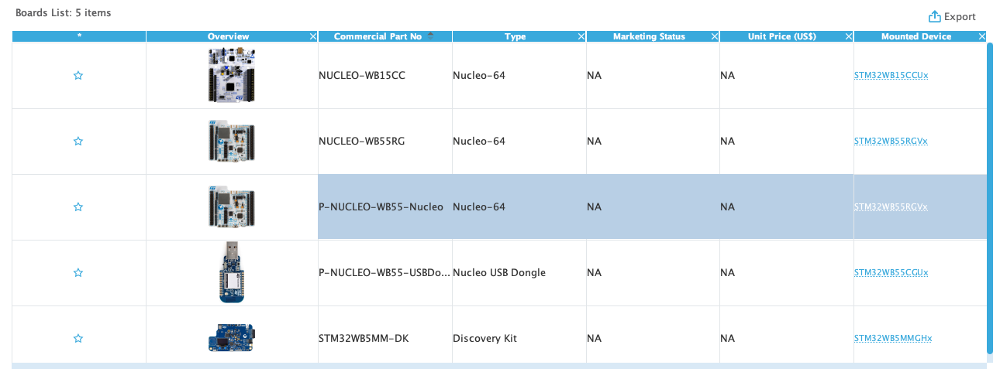
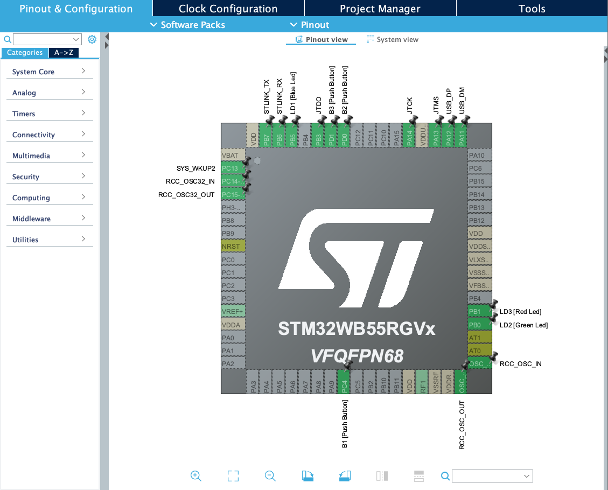
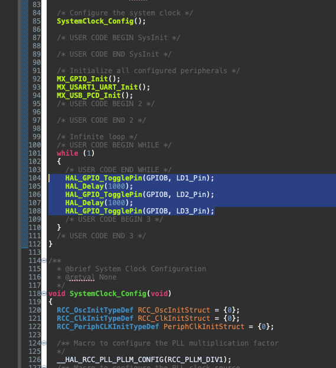
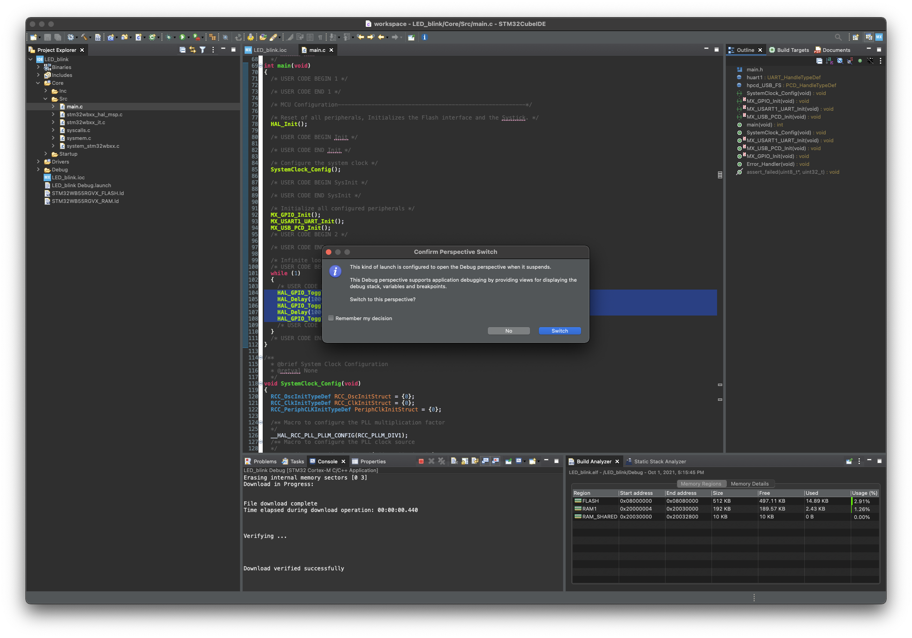
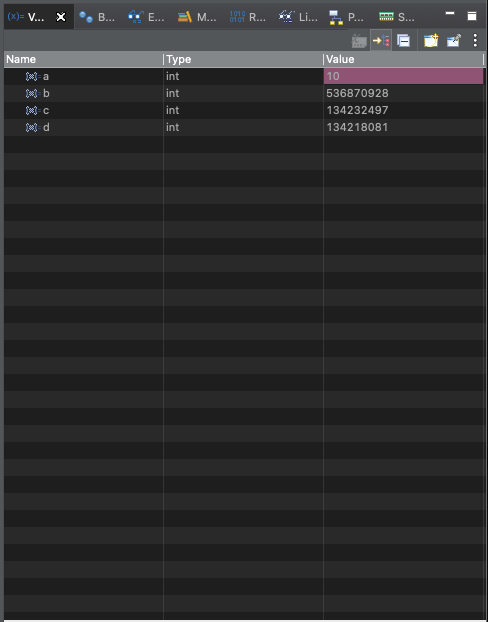
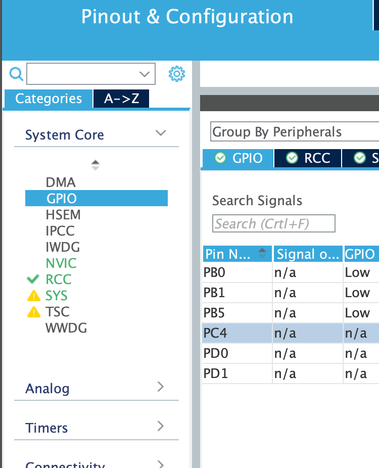

# Laboratory 5

- [Laboratory 5](#laboratory-5)
	- [Experiment 1](#experiment-1)
		- [Parts List](#parts-list)
		- [Claiming Your Repo](#claiming-your-repo)
		- [Install STM32CubeProgrammer (OPTIONAL)](#install-stm32cubeprogrammer-optional)
		- [Start A New Project](#start-a-new-project)
		- [On-Board LEDs](#on-board-leds)
		- [Edit `main.c`](#edit-mainc)
		- [Connecting Your Board](#connecting-your-board)
		- [Debugging Your Program](#debugging-your-program)
		- [Add Code](#add-code)
		- [Commit your code](#commit-your-code)
	- [Experiment 2](#experiment-2)
	- [Experiment 3](#experiment-3)
	- [Experiment 4](#experiment-4)

Make sure to include the bold questions and your answers to those questions in your report.

> *NOTE:  This is the first time this particular lab has been used.  Please send any errors to the instructor immediately so the text can be corrected.  Thanks*

You have been working with the **STM32CubeIDE** editor and debuggers.  All of this has been emulated through QEMU.  Unfortunately, if you check the the xPack website, you'll see that the STM32WB55 board, which is the board that was shipped to you, is not supported as an emulated board.

This is OK, because we are going to use the board to do some simple tasks like lighting an LED and throwing a switch.  The debugging will happen directly in the IDE and the board.  We can step through the program *on the board*.

__Reference__:  [UM2435 User Manual:  Bluetooth® Low Energy and 802.15.4 Nucleo pack based on STM32WB Series microcontrollers](supporting/dm00517423-bluetooth-low-energy-and-802154-nucleo-pack-based-on-stm32wb-series-microcontrollers-stmicroelectronics.pdf)

## Experiment 1

### Parts List
P-NUCLEO-WB55 Board (not the dongle)
(1) USB to micro-USB cable


### Claiming Your Repo

1.  Make sure you've accepted the classroom link and your repository for Lab 5.
2.  Clone your repo to your laptop.

### Install STM32CubeProgrammer (OPTIONAL)

We can upload and debug programs directly in the IDE.  However, it's also handy to be able to write code and write it directly to the board and use the board without having it connected to your laptop.  To do this, you may want to install **STM32CubeProgrammer** from ST.com.  You should navigate to [this](https://www.st.com/en/development-tools/stm32cubeprog.html) webpage and download STM32CubePrg for your machine.  You may need the login you created in Lab 1 at ST.com to download the package.  Install the package.  This is OPTIONAL and NOT REQUIRED.  For Mac users, it may be more trouble than it's worth.

NOTE:  For Mac users, the only way I was able to install the package was to go into the Application Package and run the script directly:  `./en.stm32cubeprg-mac_v2-8-0_v2.8.0/SetupSTM32CubeProgrammer-2.8.0.app/Contents/MacOs/SetupSTM32CubeProgrammer-2_8_0_macos`.  If you have Gatekeeper activated, it will (of course) reject the code.  Go into `System Preferences > Security & Privacy` and on the `General` tab there will be a button to `Open Anyway`.  Click there and it should run the installer.

### Start A New Project

1. Open up `STM32CubeIDE` and point the workspace to your new repo workspace. 
2. Go to `File > New > STM32 Project`
3. In the project window, click on the `Board Selector` tab.
4. In the list to the left, click on `STM32WB`.  Several boards will appear at the bottom of the window.




5. Select `P-NUCLEO-WB55-Nucleo` and click `Next >` at the bottom of the window.
6. Under `Project Name` put `LED_blink`.
7. You will be asked `Initialize all peripherals with their default Mode?`. Select `Yes`.
8. Select `Yes` to open to that perspective.

### On-Board LEDs

There are several LEDs onboard the WB55.  We will program these to toggle with some delay in between.  You will find the [UM2435 User Manual](supporting/dm00517423-bluetooth-low-energy-and-802154-nucleo-pack-based-on-stm32wb-series-microcontrollers-stmicroelectronics.pdf) to be helpful.

The schematic for part of the board can be found in Figure 6 of the User Manual:


We will be interfacing with the BLUE, GREEN, and RED LEDs.  They are on the left side of the schematic.  As you can see they are part of GPIOB.  This can also be seen in the pin out in the IDE:



### Edit `main.c`

Go to `main.c` by looking the Project Explorer on the left side of the IDE.  As a reminder, it's in `Core > Src > main.c`.

In the "Infinite Loop" block of `main.c`, insert the following code:

```
	HAL_GPIO_TogglePin(GPIOB, LD1_Pin);
	HAL_Delay(1000);
	HAL_GPIO_TogglePin(GPIOB, LD2_Pin);
	HAL_Delay(1000);
	HAL_GPIO_TogglePin(GPIOB, LD3_Pin);
```

It should look something like this:



Go to `Project > Build All`.  This will compile your code.  You should have no errors or warnings.  If you do, correct and try again.

### Connecting Your Board

Take your STM32WB55 board and look at the bottom of the board.  You'll see two things of note.  First, you'll see that there are several pin outs that are unshielded.  **DO NOT PLACE THE BOARD ON ANYTHING CONDUCTIVE.**  You may want to put the board on a cardboard box or some other non-conductive material.  Avoid cloth, as it can store static electricity and can fry parts of the board.  You might use an non-conductive bag like what electronics are typically shipped in.

Second, you'll see two USB ports:


Connect your USB cable to the one labled `ST-LINK`.

Plug your board into a USB port on your laptop.  If your laptop only has USB-C ports, you'll need an adapter.

At this point, you'll see the board light up and the COM light will blink a bit.

### Debugging Your Program

Open `Run > Debug Configurations` in the IDE.  You'll see a list of different types of configurations.  We want the `STM32 Cortex-M C/C++ Application`.  Select that and then press the `New Configuration` button (the white block with the yellow plus at the top left).


You should now have a `LED_blink Debug` profile under the `STM32 Cortex-M C/C++ Application`.  Press `Debug` at the bottom of the window.

The IDE will attempt to connect to the board.  You should see this window if all goes well:



Press `Switch`.

You should now be in the debugger.  It should be stopped at `HAL_Init();`.

Slowly step through each instruction with the `Step Over (F6)` button.  When you get to the `HAL_GPIO_TogglePin(GPIOB, LD1_Pin);` instruction, you should see the BLUE LED light.  Step through all of the instructions once.  All of the LEDs (BLUE, GREEN, RED) should all be lit.  Now, step through the loop again.  Each of the lights should go out.  Now, press the `Resume` button and let the program run freely.  You should see the lights light up and go out in sequence.  Stop the program.

### Add Code

There is a delay statement missing.  Put it in after the last `TogglePin` instruction.  **What happens?**

### Commit your code

Commit your code to your repository.

Close that project in the Project Explorer.

## Experiment 2

Go to `File > New > STM32 Project`.  Create a new project called `computation` in your workspace.  Do everything you did above to get to `main.c`.  In the infinite loop, assign two variables, `a` and `b` as integers.  Assign `a = 10` and `b = 30`.  Create a new variable, `c` that is the addition of `a` and `b`.   Create another variable `d` that is the multiplication of `a` and `c`.

Compile your code by going to `Project > Build Project`.

Now, start the debugger and step through this code on your board.  In the upper right, you should have a window that contains the variables:



In this image, `a` has been executed, but `b`, `c`, and `d` have not, so those memory locations have junk in them.  That is, they have been allocated, but not initialized.

Take a screenshot of the variables after you have executed all of the instructions in the loop.  Include it in your lab report.

The other tabs in that window are `Breakpoints`, `Expressions`, `Registers`, `Live Expressions`, `Peripherals`, and `SFRs`.  You can see the state of the board while you are debugging.  Can you trace the data through the microcontroller and see which memory and/or registers are being used for the calculations?

Close this project and commit your code to your repo.

## Experiment 3

In this experiment, we will interface with one of the switches on the board.  Start a new project called `switch`.  Make sure to initialize the perpherials to their Default mode.

Here is the schematic of the WB55 board again:


Locate `SW1`, `SW2`, and `SW3` on the schematic.  Note that `SW1` is actually controlled by two different ports, `GPIOC 4` and `GPIOC 13`.  But you will also note that there are two jumpers associated with `PC4` and `PC13`.  Look through the WB55 User Manual.

**What are these two jumpers and what does this switch do in its Default configuration?**

Let's poll `SW1` in its default configuration and see what happens.  Place a `HAL_GPIO_ReadPin` command in the infinite loop and read that pin into a variable.  Make sure to declare the variable with the correct type.  Debug the program on the board and while you execute that instruction, note the value of the variable.  You may want to put some sort of command/statement after the `HAL_GPIO_ReadPin` command, so that you can see the variable.  The variable gets reset and removed from the Expressions window each time you start the infinite loop over.

You should notice that the pin might be in an unstable state or stuck with zero or one, no matter what you do.  To correct this, let's set the state of the pin.  We'll do this one of two ways.  First, we'll do it through the graphical interface.  Make sure to stop debugging, if you haven't already.  Go to the `switch.ioc` view in the IDE.  In the Pinout Configuration tab, there are several pulldown menus.  Select `System Core > GPIO`.  Here you should see a list of the configured GPIO pins.



Select `PC4`.  At the bottom of the window, you'll see a couple of configuration options.  Leave the pin an `INPUT` pin and select `Pull Up` in the `Pull Up/Pull Down`.  Select `Save` (or CTRL-S for Windows/COMMAND-S for Mac).  It will ask if you want to generate code.  Select `Yes` and switch to that perspective.

Look for `MX_GPIO_Init` block of code further down in `main.c`.  Note this code:

```
  GPIO_InitStruct.Pin = GPIO_PIN_4;
  GPIO_InitStruct.Mode = GPIO_MODE_INPUT;
  GPIO_InitStruct.Pull = GPIO_PULLUP;
  HAL_GPIO_Init(GPIOC, &GPIO_InitStruct);
```

Now the GPIO pin is "pulled up", meaning that it has a logical 1 placed on the pin as default.

You will also note that the code you added early may be gone.  Add the code back in and repeat the experiment.  Are there two distinct states now?  Which state goes with which action?

> *NOTE:  I found trying to press the button with my fingers to be . . . challenging.  Then again, I have fat-ish fingers.  You might want to keep a pencil or pen handy to press the button.

Close this project and commit your code.

## Experiment 4

Now, using the work above as the foundation, write a program that allows a user to press `SW1` some number of times and then press `SW2`.  When `SW2` is pressed, the BLUE LED light will blink on and off--with a 1 second delay between those states--the same number of times that `SW1` was pressed, up to 10 times maximum.  That is, if the user presses `SW1` more than 10 times, the light only blinks 10 times.  If the user presses `SW1` less than 10 times, then the LED blinks the same number of times the user pressed `SW1`.

Think through the entire problem first before writing code.  Make sure to include a flowchart or state diagram of the problem and include it in your report.

Save your project and commit the code to your repo once you are done.
